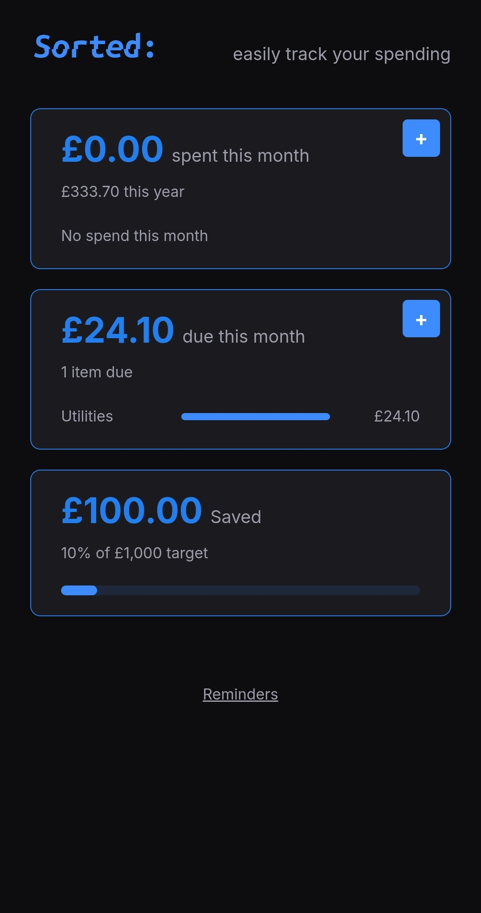
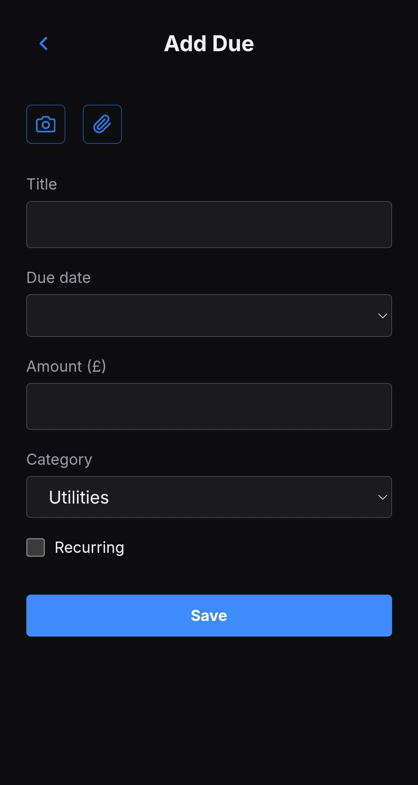
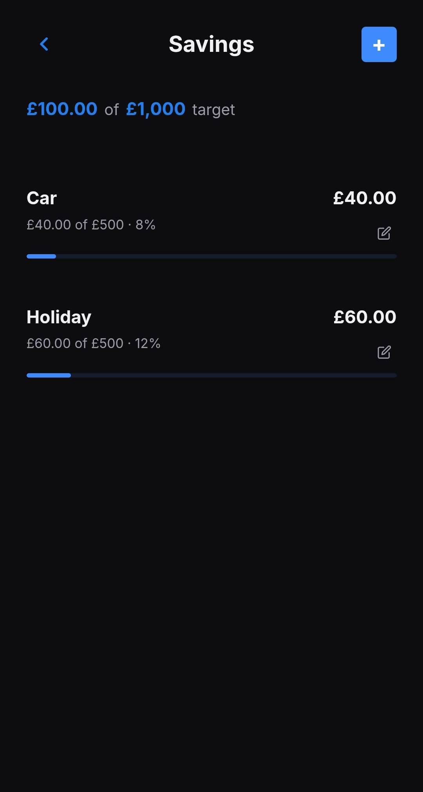

# Sorted

Easily check and track your spending, saving and bills, all local and private.

## Screenshot

## Features

- Dashboard: spend, savings, and due at a glance, no scrolling required
- Itemised spend, savings, and due lists — edit, confirm, reorder, filter
- Phone: capture receipts by photo or manual entry
- Desktop: full editor with client-side OCR, categorisation, and Brave-powered spending tips
- Installable PWA with daily reminders on Android
- Sync between phone and desktop via Syncthing, no cloud involved

## Tech Stack

- Vanilla HTML, CSS, and JavaScript, no frameworks
- Tesseract.js for client-side OCR
- File System Access API for desktop auto-ingest of synced receipts
- Brave Search API for spending tips (optional, uses your own key)
- Service worker for offline PWA support

## Running Locally

Clone the repo, then serve the folder with any static file server, for example:

    git clone https://github.com/jaquesbody/sorted.git
    cd sorted
    python3 -m http.server

Then open `http://localhost:8000` in your browser.

## Privacy

No backend, no cloud storage, no login. All data stays on your own devices, synced directly between them via Syncthing. OCR runs entirely in your browser. If you use the Brave API for spending tips, your key is stored locally, never sent anywhere except Brave's API directly.

## Licence

MIT — see [LICENSE](LICENSE).
