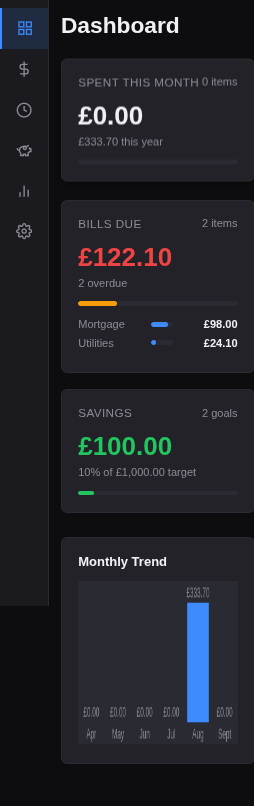
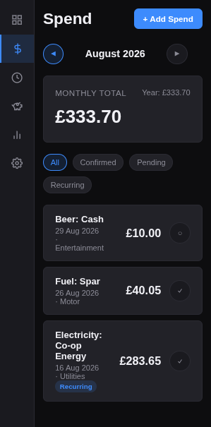

# Sorted

Easily check and track your spending, saving and bills, all local and private.

**Sorted v2** is a modern rewrite: a dark-themed finance tracker that runs as a desktop app (Electron) and straight in your browser. No backend, no cloud, no login — everything lives in your device's local storage (IndexedDB).

Try it live at [jaquesbody.github.io/sorted](https://jaquesbody.github.io/sorted/) — no install needed.

## Screenshots

## Features

- Dashboard: spent this month, bills due, savings progress, and a 6-month trend chart
- Spend, Bills Due, and Savings lists — add, edit, and delete; confirm spend entries and mark bills as paid
- Reports: spending and bills broken down by category
- Month navigation and status filters
- Receipt OCR: snap or upload a receipt (image or PDF) on the Spend or Bills form and the app pre-fills the title and amount for you to confirm
- Export / import your whole dataset as JSON
- Sample data seeds on first run so the app isn't empty

## Run It

### Desktop app (Electron)

    git clone https://github.com/jaquesbody/sorted.git
    cd sorted
    npm install
    npm start

### In a browser

Serve the `docs` folder with any static file server:

    git clone https://github.com/jaquesbody/sorted.git
    cd sorted
    python3 -m http.server --directory docs

Then open `http://localhost:8000` in your browser. Same app, minus the native export dialogs (export downloads a JSON file instead).

### Android (APK)

Grab [`sorted-v2-2.0.1-debug.apk`](sorted-v2-2.0.1-debug.apk) from this repo and sideload it (your phone will ask to allow installs from unknown sources). It's the same app wrapped in a WebView — fully offline, data stored on the phone.

To rebuild it yourself (needs JDK 21 and the Android SDK):

    npm install
    npx cap sync android
    cd android
    ./gradlew assembleDebug

Note: importing JSON works on every platform. Export uses the native save dialog on desktop and downloads a file in the browser; writing an export directly to Android device storage isn't wired up yet.

## Tech Stack

- Vanilla HTML, CSS, and JavaScript — no frameworks
- Electron for the desktop shell
- IndexedDB for local storage
- Zero runtime dependencies in the web app (OCR and PDF libraries are vendored in the repo)

## Privacy

No backend, no cloud storage, no login. All data stays on your own device and only leaves it when you export it yourself.

## History

v1 — the original web/PWA with service worker and Syncthing sync — lives in the git history; check out any commit from before the v2 rebuild to run it.

## Licence

MIT — see [LICENSE](LICENSE).
