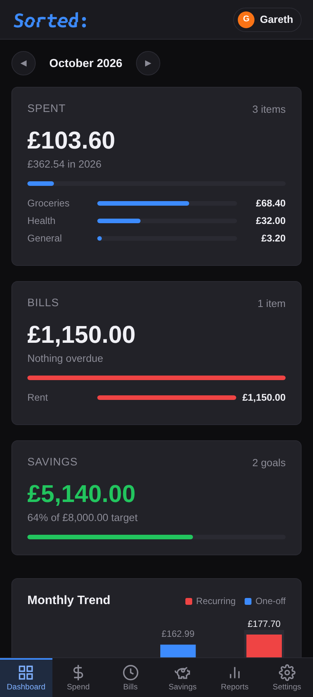
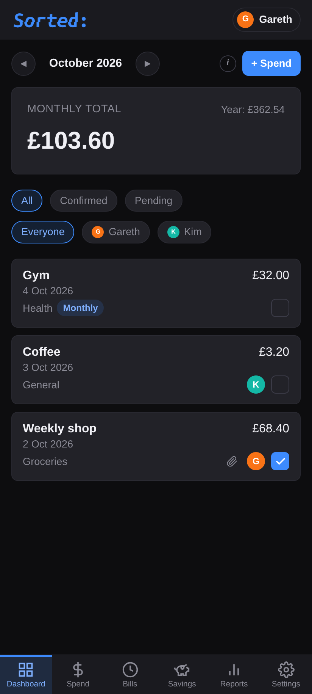
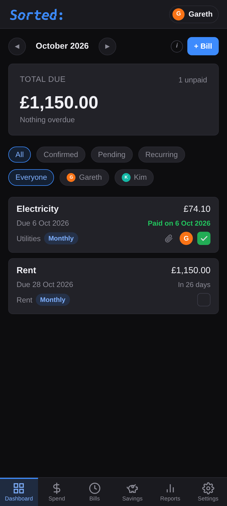
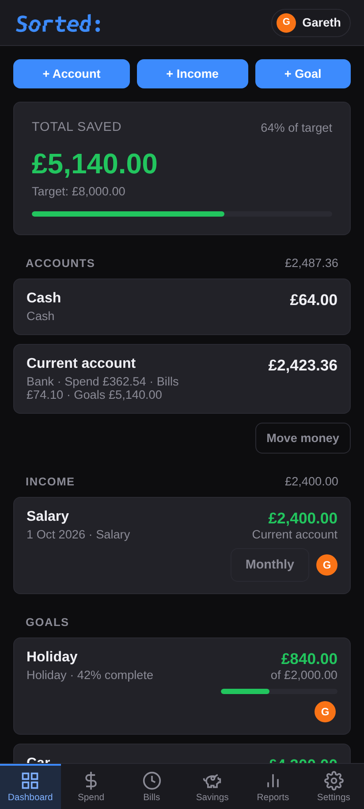
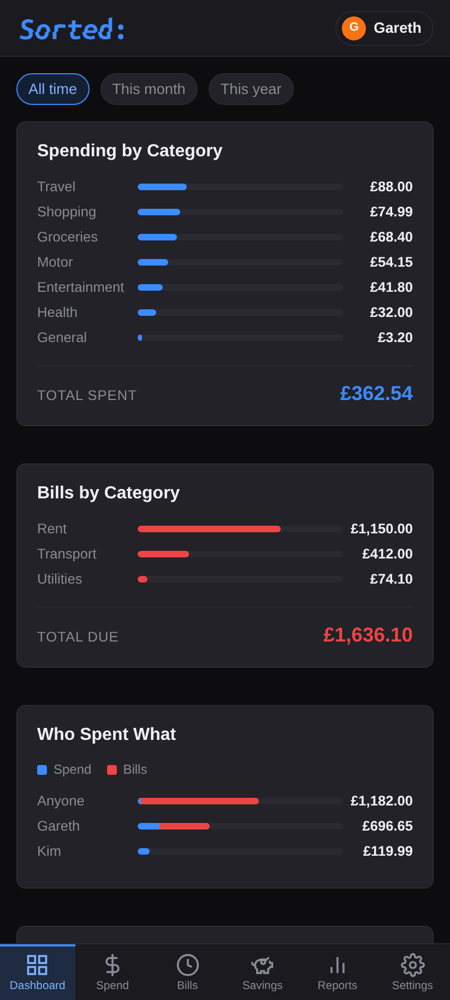
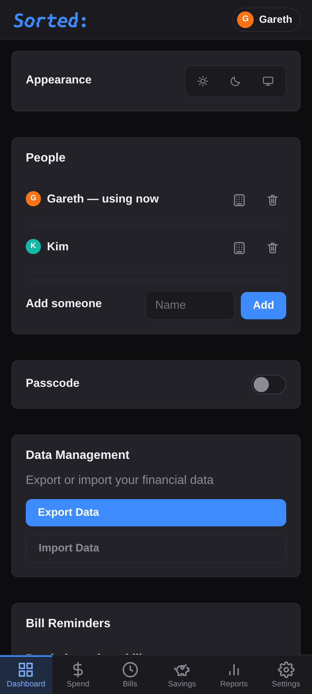

# Sorted

Easily check and track your spending, saving and bills, all local and private.

**Sorted v2** is a modern rewrite: a dark-themed finance tracker that runs as a desktop app (Electron) and straight in your browser. No backend, no cloud, no login — everything lives in your device's local storage (IndexedDB).

Try it live at [jaquesbody.github.io/sorted](https://jaquesbody.github.io/sorted/) — no install needed.

## Screenshots

All six are the same household on a 412px phone viewport: Gareth and Kim, a
current account and some cash, two goals, and a month with a bill already paid.

| | |
|---|---|
|  |  |
|  |  |
|  |  |

## Features

- Dashboard: spent, bills due and savings for whichever month you're looking at, plus a 6-month trend chart that splits recurring from one-off spend
- People: mark spend, bills and savings goals as somebody's, and see a coloured dot on each row. A chip in the top bar says who's using the app, so new entries and bill payments are marked automatically. This is attribution, not a login — anyone can switch, and there's still no account
- Give someone a PIN and entering it instead of the app passcode both unlocks the app and switches to them, so the right person is marked without touching anything. The app passcode keeps working exactly as before, and anyone who can reach Settings can reset a PIN without knowing it — it says who you are, not that you're allowed in
- A person filter on Spend and Bills — Everyone, or one person — sharing one selection across both. The Spend total follows it; the Bills total stays household-wide
- Marking a bill paid records who paid it, which can be someone other than the bill's owner
- Spend, Bills, and Savings lists — add, edit, and delete; confirm spend entries and mark bills as paid
- A bill you tick is still a bill: it stays in the list with the date you paid it, its tick un-pays it, and it can still be edited. Deleting a repeating bill asks which you mean — this one, or this one and every month of it
- Every row reads as a small table: the amount on the right, its timing underneath, and the receipt paperclip, the person and the tick in one 24px row beneath that. The paperclip only appears when there's actually a picture
- Recurring: say whether something repeats monthly or annually. It rolls its due date forward by that much when paid, and projects its own next occurrences into the months ahead — twelve months for monthly, the same time next year for annual — so stepping forward shows what those months hold instead of an empty page. Projected rows are dashed, marked, and have no buttons: they're a forecast, not something to pay
- A month selector on Dashboard, Spend and Bills, all the same width; tap the month name to jump back to the current one
- Bills filters — All, Confirmed, Pending, Recurring — over the month's bills paid as well as unpaid, so a month you've already dealt with is still worth looking at
- Reports: spending, bills and savings goals broken down by category, over all time, this month or this year. Each card carries its own total underneath its breakdown
- Three reminders, each off until you ask for it: bills coming due or already overdue, nothing recorded today, and a savings goal going untouched. On Android these are scheduled by the system, so they arrive whether or not Sorted is open — bills in the morning, the other two at a time you pick. In a browser there's no way to wake the app at a set hour, so the same checks run when you open it and put it away, and the settings say so rather than implying more
- Start Over: delete everything and start from empty, in Settings. A new install starts empty too — there's no sample data to delete
- Reminders are rebuilt from the database every time anything changes — a bill paid, a spend recorded, a goal topped up, anything deleted, everything wiped — rather than tracked one at a time, so what arrives always matches the data
- Switching tabs always opens at the top of the new tab rather than wherever you left the last one
- A "Who Spent What" report: one bar per person, its length their share of the household total, split blue for what they spent and red for what they owe. Money nobody is marked against is its own row, so the card adds up to the summary
- Month navigation and status filters
- Categories: Utilities, Motor, Entertainment, Shopping, General, Travel, One-Off — the same list for bills as for spend, and anything an entry is already filed under stays offered. Savings goals have their own: Holiday, Car, Christmas, One-Off, Other
- A savings goal you've reached turns the whole card green with the text in black and a tick beside it
- Bank accounts, and cash as an account rather than a separate payment method. The Savings page lists them above your goals, each with a balance and the spend, bills and goal amounts that moved it. Spending, paying a bill or putting money into a goal says which account it came from, and the balance follows on its own
- Move money between accounts when you transfer it for real, and adjust a balance by hand for anything the app can't infer (interest, fees, a correction)
- Reports gains a "Where Your Money Is" card and a Forecast chart
- Receipt capture: snap or upload a receipt (image or PDF) on the Spend or Bills form and the app pre-fills the title, amount and date for you to confirm
- Receipts are kept with the entry — a paperclip on the row opens it full size, and the Edit popup can view, replace or remove it. PDFs are stored as a first-page image
- Light, dark, or follow-the-system theme, set in Settings and applied before the first paint
- Android asks for the notification permission on first use (Android 13+ requires it, and without it the channel is created silently and nothing ever appears). The schedule is **inexact** on purpose — an exact alarm needs its own grant, and Play only allows it to alarm-clock apps
- Optional passcode: a numeric keypad locks the app on launch and again after a set idle period (1, 5 or 30 minutes, or immediately when it's put away). Only a salted hash of the passcode is stored
- Export / import your whole dataset as JSON — importing asks first: merge (existing kept, duplicates skipped) or replace everything (double-confirmed). Receipt images and your list of people travel with the backup
- Works in the browser, on the desktop as an Electron app, and on Android — where the six destinations sit in a bottom bar instead of a side rail

## Run It

### Desktop app (Electron)

    git clone https://github.com/jaquesbody/sorted.git
    cd sorted
    npm install
    npm start

### In a browser

Serve the `docs` folder with any static file server:

    git clone https://github.com/jaquesbody/sorted.git
    cd sorted
    python3 -m http.server --directory docs

Then open `http://localhost:8000` in your browser. Same app, minus the native export dialogs (export downloads a JSON file instead).

### Android (APK)

Grab [`sorted-v2-2.18.0-debug.apk`](sorted-v2-2.18.0-debug.apk) from this repo and sideload it (your phone will ask to allow installs from unknown sources). It's the same app wrapped in a WebView — fully offline, data stored on the phone. The phone build moves the six destinations into a bottom bar; append `?native` to the web URL to preview that layout in a desktop browser.

### Updating an installed copy

Sideloading a new APK over the old one **keeps your data** — Android replaces the app but leaves its storage, which is where the app's IndexedDB lives. Just install the newer file over the older one; don't uninstall first, because uninstalling is what deletes the data.

Exported before upgrading is the belt to that braces: the export is a JSON file you can import again if a build turns out to be broken.

To rebuild it yourself (needs JDK 21 and the Android SDK):

    npm install
    npx cap sync android
    cd android
    ./gradlew assembleDebug

The signing key is committed at `android/debug.keystore` and pinned in `build.gradle`, so any machine can build an APK that installs as an update over an existing one. Android rejects an update signed with a different key, so if you ever change that file the next install will be refused and the only fix would be an uninstall — which deletes the data. Its fingerprint is recorded in `build.gradle`; if a build ever starts failing to install, check that the APK's certificate still matches the keystore's.

Note: importing JSON works on every platform. Export uses the native save dialog on desktop, opens the system share sheet on Android, and downloads a file in the browser.

## Tech Stack

- Vanilla HTML, CSS, and JavaScript — no frameworks
- Electron for the desktop shell
- IndexedDB for local storage, plus `localStorage` for the theme and passcode
- Zero runtime dependencies in the web app (OCR and PDF libraries are vendored in the repo)
- `@capacitor/local-notifications`, for scheduled reminders on Android. It's the only plugin the app uses, and it needs no server
- Tesseract and pdf.js are loaded on demand, when a receipt is actually picked, rather than on every page load — they are two thirds of the payload and a screen doesn't need either

## Privacy

No backend, no cloud storage, no login. All data stays on your own device and only leaves it when you export it yourself.

Accounts, income and their transfers are part of that: balances are worked out on your device from your own entries and never sent anywhere.

Reminders are local too, and can only be as private as the thing they mention: a bill notification carries its title and amount, and the spending nudge says whether today is empty. Anyone holding the phone can read that from the lock screen — the same exposure the app's own lock screen already has. There's no server that could see any of it, and no reminder can be turned into anything that reaches anyone else. The Forecast card projects your balance **day by day** over a window you choose — 1, 3, 6 or 12 months — from your balances, your income's dates, your bills' dates and an average of your other spending. Step it back a month and it shows days you actually recorded rather than a projection. It tells you the lowest point your balance reaches and when, which is usually just before payday.

People are labels, not accounts: a person is a name and a colour, and anyone can switch who they're being. That makes attribution useful on a shared device and useless against anyone determined — it is not access control.

The passcode is a privacy screen, not encryption: it stops the app being readable when you hand your phone over, and it can't protect data from anyone who already has the unlocked device. It isn't backed up, so a forgotten passcode means clearing the app's storage to get back in.

A person's PIN works the same way, with one extra thing to be clear about. It identifies who is using the app — it does not authenticate them. Anyone who gets into the app can reset anyone's PIN from Settings without knowing the old one, and can still switch the top-bar chip afterwards. It saves a shared device from attributing your shopping to the wrong person; it is not a way of keeping anyone out, and a four-digit family PIN is not something to rely on. Person PINs aren't backed up either.

## History

v1 — the original web/PWA with service worker and Syncthing sync — lives in the git history; check out any commit from before the v2 rebuild to run it.

## Licence

MIT — see [LICENSE](LICENSE).
