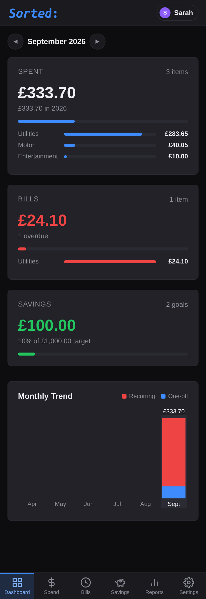
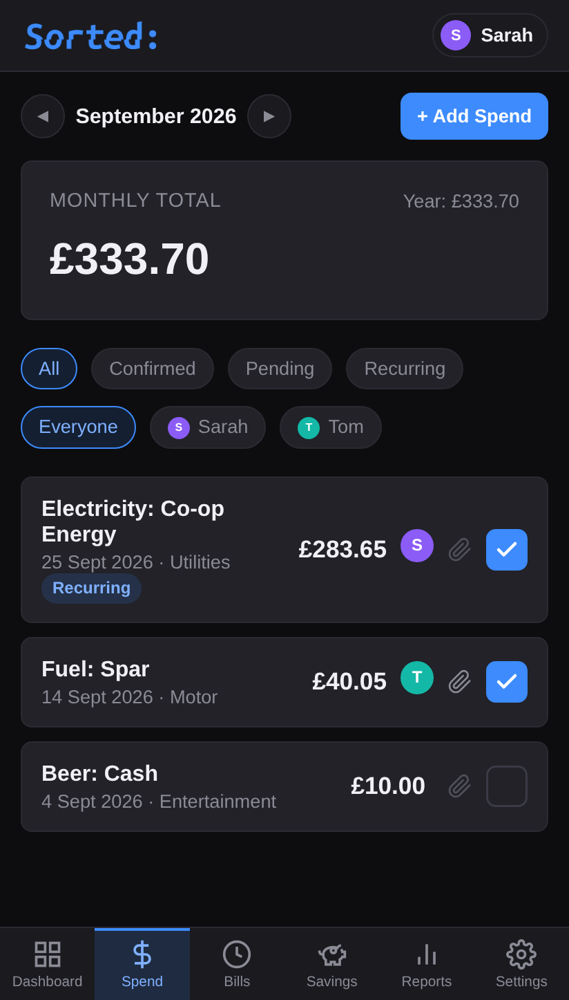

# Sorted

Easily check and track your spending, saving and bills, all local and private.

**Sorted v2** is a modern rewrite: a dark-themed finance tracker that runs as a desktop app (Electron) and straight in your browser. No backend, no cloud, no login — everything lives in your device's local storage (IndexedDB).

Try it live at [jaquesbody.github.io/sorted](https://jaquesbody.github.io/sorted/) — no install needed.

## Screenshots

## Features

- Dashboard: spent, bills due and savings for whichever month you're looking at, plus a 6-month trend chart that splits recurring from one-off spend
- People: mark spend, bills and savings goals as somebody's, and see a coloured dot on each row. A chip in the top bar says who's using the app, so new entries and bill payments are marked automatically. This is attribution, not a login — anyone can switch, and there's still no account
- Give someone a PIN and entering it instead of the app passcode both unlocks the app and switches to them, so the right person is marked without touching anything. The app passcode keeps working exactly as before, and anyone who can reach Settings can reset a PIN without knowing it — it says who you are, not that you're allowed in
- A person filter on Spend and Bills — Everyone, or one person — sharing one selection across both. The Spend total follows it; the Bills total stays household-wide
- Marking a bill paid records who paid it, which can be someone other than the bill's owner
- Spend, Bills, and Savings lists — add, edit, and delete; confirm spend entries and mark bills as paid
- Recurring bills: marking one paid copies the payment into Spend and rolls the due date a month forward
- A month selector on Dashboard, Spend and Bills, all the same width; tap the month name to jump back to the current one
- Bills filters — All, Confirmed, Pending, Recurring — over the month's bills paid as well as unpaid, so a month you've already dealt with is still worth looking at
- Reports: spending, bills and savings goals broken down by category, over all time, this month or this year
- A "Who Spent What" report: one bar per person, its length their share of the household total, split blue for what they spent and red for what they owe. Money nobody is marked against is its own row, so the card adds up to the summary
- Month navigation and status filters
- Receipt capture: snap or upload a receipt (image or PDF) on the Spend or Bills form and the app pre-fills the title, amount and date for you to confirm
- Receipts are kept with the entry — a paperclip on the row opens it full size, and the Edit popup can view, replace or remove it. PDFs are stored as a first-page image
- Light, dark, or follow-the-system theme, set in Settings and applied before the first paint
- Optional passcode: a numeric keypad locks the app on launch and again after a set idle period (1, 5 or 30 minutes, or immediately when it's put away). Only a salted hash of the passcode is stored
- Export / import your whole dataset as JSON — importing asks first: merge (existing kept, duplicates skipped) or replace everything (double-confirmed). Receipt images and your list of people travel with the backup
- Works in the browser, on the desktop as an Electron app, and on Android — where the six destinations sit in a bottom bar instead of a side rail
- Sample data seeds on first run so the app isn't empty

## Run It

### Desktop app (Electron)

    git clone https://github.com/jaquesbody/sorted.git
    cd sorted
    npm install
    npm start

### In a browser

Serve the `docs` folder with any static file server:

    git clone https://github.com/jaquesbody/sorted.git
    cd sorted
    python3 -m http.server --directory docs

Then open `http://localhost:8000` in your browser. Same app, minus the native export dialogs (export downloads a JSON file instead).

### Android (APK)

Grab [`sorted-v2-2.3.0-debug.apk`](sorted-v2-2.3.0-debug.apk) from this repo and sideload it (your phone will ask to allow installs from unknown sources). It's the same app wrapped in a WebView — fully offline, data stored on the phone. The phone build moves the six destinations into a bottom bar; append `?native` to the web URL to preview that layout in a desktop browser.

To rebuild it yourself (needs JDK 21 and the Android SDK):

    npm install
    npx cap sync android
    cd android
    ./gradlew assembleDebug

Note: importing JSON works on every platform. Export uses the native save dialog on desktop, opens the system share sheet on Android, and downloads a file in the browser.

## Tech Stack

- Vanilla HTML, CSS, and JavaScript — no frameworks
- Electron for the desktop shell
- IndexedDB for local storage, plus `localStorage` for the theme and passcode
- Zero runtime dependencies in the web app (OCR and PDF libraries are vendored in the repo)
- Tesseract and pdf.js are loaded on demand, when a receipt is actually picked, rather than on every page load — they are two thirds of the payload and a screen doesn't need either

## Privacy

No backend, no cloud storage, no login. All data stays on your own device and only leaves it when you export it yourself.

People are labels, not accounts: a person is a name and a colour, and anyone can switch who they're being. That makes attribution useful on a shared device and useless against anyone determined — it is not access control.

The passcode is a privacy screen, not encryption: it stops the app being readable when you hand your phone over, and it can't protect data from anyone who already has the unlocked device. It isn't backed up, so a forgotten passcode means clearing the app's storage to get back in.

A person's PIN works the same way, with one extra thing to be clear about. It identifies who is using the app — it does not authenticate them. Anyone who gets into the app can reset anyone's PIN from Settings without knowing the old one, and can still switch the top-bar chip afterwards. It saves a shared device from attributing your shopping to the wrong person; it is not a way of keeping anyone out, and a four-digit family PIN is not something to rely on. Person PINs aren't backed up either.

## History

v1 — the original web/PWA with service worker and Syncthing sync — lives in the git history; check out any commit from before the v2 rebuild to run it.

## Licence

MIT — see [LICENSE](LICENSE).
